# 🏗️ Zetatech.Accelerate - Arquitectura y Dependencias

**Framework Personalizado Multi-Capa con 12 Proyectos Independientes**
*Cada proyecto genera su propio paquete NuGet para máxima modularidad y reutilización*

---

## 📐 Diagrama Arquitectónico de Dependencias

```mermaid
graph TD
    %% Capa de Presentación/Web
    AspNetCore["🌐 AspNetCore<br/>(Componentes Web)"]

    %% Capa de Aplicación
    Application["📱 Application<br/>(DTOs, Servicios)"]

    %% Capa de Dominio
    Domain["🏢 Domain<br/>(Lógica de Negocio)"]

    %% Capa de Datos
    Data["📊 Data<br/>(Entity Framework)"]

    %% Utilidades Transversales
    Serialization["🔀 Serialization<br/>(JSON)"]
    Http["📡 Http<br/>(Cliente HTTP)"]
    Cache["💾 Cache<br/>(Gestión Caché)"]

    %% Servicios Cross-Cutting
    Exceptions["⚠️ Exceptions<br/>(Catálogo)"]
    Jobs["⏱️ Jobs<br/>(Background)"]
    Logging["📝 Logging<br/>(Log)"]
    Messaging["📨 Messaging<br/>(RabbitMQ)"]

    %% Relaciones de dependencia
    AspNetCore --> Exceptions
    AspNetCore --> Serialization

    Domain --> Data

    Http --> Serialization

    Cache --> Jobs
    Logging --> Jobs

    %% Estilos por capas
    classDef presentation fill:#FF6B6B,stroke:#C92A2A,color:#fff,stroke-width:3px
    classDef application fill:#4ECDC4,stroke:#0A8074,color:#fff,stroke-width:2px
    classDef domain fill:#45B7AA,stroke:#1E7D74,color:#fff,stroke-width:2px
    classDef data fill:#2A9D8F,stroke:#0D5544,color:#fff,stroke-width:2px
    classDef utility fill:#E8D4A8,stroke:#B39D5C,color:#333,stroke-width:2px
    classDef support fill:#FFD580,stroke:#FFA500,color:#333,stroke-width:2px

    class AspNetCore presentation
    class Application application
    class Domain domain
    class Data data
    class Serialization,Http,Cache utility
    class Exceptions,Jobs,Logging,Messaging support
```



---

---

## 🏛️ Descripción de las Capas de Arquitectura

El framework Zetatech.Accelerate implementa una **arquitectura hexagonal multi-capa** que organiza los 12 proyectos en 4 capas funcionales más 2 niveles de servicios transversales:

### **Capas Horizontales (Clean Architecture)**

```
┌──────────────────────────────────────────────────────────────────┐
│ CAPA 1: PRESENTACIÓN (Punto de Entrada)                         │
│ └─ AspNetCore: Expone APIs HTTP, Middleware, Configuración      │
├──────────────────────────────────────────────────────────────────┤
│ CAPA 2: APLICACIÓN (Orquestación de Lógica)                     │
│ └─ Application: Servicios, DTOs, Casos de Uso                   │
├──────────────────────────────────────────────────────────────────┤
│ CAPA 3: DOMINIO (Lógica de Negocio Pura)                        │
│ └─ Domain: Entidades, Agregados, Especificaciones               │
├──────────────────────────────────────────────────────────────────┤
│ CAPA 4: PERSISTENCIA (Acceso a Datos)                           │
│ └─ Data: Entity Framework, Repositories, Unit of Work           │
├──────────────────────────────────────────────────────────────────┤
│ SERVICIOS TRANSVERSALES (Disponibles en toda la arquitectura)   │
│ ├─ Serialization: JSON/Conversión de objetos                    │
│ ├─ Http: Cliente HTTP para llamadas externas                    │
│ ├─ Cache: Gestión de caché en memoria                           │
│ ├─ Exceptions: Catálogo centralizado de errores                 │
│ ├─ Jobs: Procesamiento en segundo plano                         │
│ ├─ Logging: Registro de actividad (Console, File)               │
│ └─ Messaging: Publicador/Suscriptor (RabbitMQ)                  │
└──────────────────────────────────────────────────────────────────┘
```

### **Característica Especial: Proyecto Core**

Aunque no aparece como dependencia explícita en los .csproj de esta solución, el proyecto **Zetatech.Accelerate** (carpeta raíz) actúa como:
- **Contenedor de interfaces y abstracciones** compartidas por todos los proyectos
- **Definidor de contratos** que implementan los demás proyectos
- **Centro de configuración** para la inyección de dependencias
- **Catálogo de extensiones** para facilitar la composición de servicios

---

## 🏗️ Clasificación de Proyectos por Capas Arquitectónicas

### **Capa de Presentación Web** 🌐
Componentes específicos para la exposición de APIs y servicios web en ASP.NET Core.

| Proyecto | Descripción |
|----------|-------------|
| **AspNetCore** | Middleware, Controllers, Configuración de DI, CORS, Rate Limiting, Static Assets |

---

### **Capa de Aplicación** 📱
Lógica de coordenación, DTOs, y servicios de aplicación que orquestan la lógica de negocio.

| Proyecto | Descripción |
|----------|-------------|
| **Application** | Servicios de aplicación, Data Transfer Objects (DTOs), Mapeos |

---

### **Capa de Dominio** 🏢
Modelos de dominio y lógica de negocio pura, independiente de frameworks.

| Proyecto | Descripción |
|----------|-------------|
| **Domain** | Entidades, Agregados, Especificaciones, Lógica de negocio core |

---

### **Capa de Persistencia** 📊
Acceso a datos y operaciones con la base de datos.

| Proyecto | Descripción |
|----------|-------------|
| **Data** | Entity Framework Core, Repositories, Unit of Work, Abstracciones de acceso a datos |

---

### **Servicios Transversales de Utilidad** 🔧
Componentes reutilizables que proporcionan funcionalidad común.

| Proyecto | Descripción |
|----------|-------------|
| **Serialization** | Componentes de serialización/deserialización JSON |
| **Http** | Cliente HTTP reutilizable para llamadas externas |
| **Cache** | Gestión de caché en memoria y lógica de cacheo |

---

### **Servicios Cross-Cutting** ⚡
Servicios transversales que afectan múltiples capas.

| Proyecto | Descripción |
|----------|-------------|
| **Exceptions** | Catálogo centralizado de excepciones del framework |
| **Jobs** | Procesamiento de trabajos en segundo plano (timers, tareas asincrónicas) |
| **Logging** | Proveedores y configuración de logging (Console, File) |
| **Messaging** | Publicador/Suscriptor de mensajes (RabbitMQ) |

---

## 🔗 Tabla Completa de Dependencias Directas

| # | Proyecto | Tipo | Depende de | Descripción |
|---|----------|------|-----------|------------|
| 1 | **AspNetCore** | Web | Exceptions, Serialization | Middleware y handlers HTTP que requieren serialización y manejo de excepciones |
| 2 | **Application** | App | *(ninguna)* | Capa autónoma de aplicación |
| 3 | **Domain** | Domain | Data | Especificaciones y servicios de dominio que usan abstracciones de datos |
| 4 | **Data** | Data | *(ninguna)* | Capa de persistencia independiente |
| 5 | **Serialization** | Utility | *(ninguna)* | Utilidad fundamental sin dependencias |
| 6 | **Http** | Utility | Serialization | Cliente HTTP que serializa/deserializa payloads |
| 7 | **Cache** | Utility | Jobs | Caché que se integra con sistema de jobs |
| 8 | **Exceptions** | CrossCutting | *(ninguna)* | Catálogo centralizado de excepciones |
| 9 | **Jobs** | CrossCutting | *(ninguna)* | Base para procesos en background |
| 10 | **Logging** | CrossCutting | Jobs | Logger que integra con sistema de jobs |
| 11 | **Messaging** | CrossCutting | *(ninguna)* | Publicador/Suscriptor independiente |

---

## 🎯 Matriz de Influencia de Cambios

Análisis de impacto: Si realizas cambios en un proyecto, ¿qué otros proyectos se ven potencialmente afectados?

### **Matriz Bidireccional de Impacto**

| Proyecto | Cambios Impactan a... | Reciben Cambios de... | Nivel de Riesgo |
|----------|---|---|---|
| **Exceptions** | AspNetCore | *(ninguno)* | 🟢 BAJO - Cambios aislados |
| **Serialization** | AspNetCore, Http | *(ninguno)* | 🟢 BAJO - Cambios aislados |
| **Data** | Domain | *(ninguno)* | 🟡 MEDIO - Domain depende |
| **Jobs** | Cache, Logging | *(ninguno)* | 🟡 MEDIO - Dos dependientes |
| **Application** | *(ninguno)* | *(ninguno)* | 🟢 BAJO - Totalmente independiente |
| **Messaging** | *(ninguno)* | *(ninguno)* | 🟢 BAJO - Totalmente independiente |
| **Domain** | *(ninguno)* | Data | 🟡 MEDIO - Depende de Data |
| **Http** | *(ninguno)* | Serialization | 🟢 BAJO - Solo depende de Serialization |
| **Cache** | *(ninguno)* | Jobs | 🟢 BAJO - Solo depende de Jobs |
| **Logging** | *(ninguno)* | Jobs | 🟢 BAJO - Solo depende de Jobs |
| **AspNetCore** | *(ninguno)* | Exceptions, Serialization | 🟡 MEDIO - Punto de entrada |

### **Cadena de Impacto Completa**

```
Cambio en EXCEPCIONES
    └─> AspNetCore (requiere revalidación)

Cambio en SERIALIZACIÓN
    ├─> Http (compatibilidad de formatos)
    └─> AspNetCore (serialización de responses)

Cambio en DATA
    └─> Domain (abstracción de acceso a datos)
        └─> AspNetCore (al usar Domain indirectamente)

Cambio en JOBS
    ├─> Cache (integración de background jobs)
    └─> Logging (workers de logging)

Cambio en APPLICATION
    └─> NINGUNO - Cambios contenidos

Cambio en MESSAGING
    └─> NINGUNO - Cambios contenidos
```

---

## 🔄 Flujo de Integración de Componentes

### **Secuencia de Inicialización en ASP.NET Core**

Cuando se registran todos los servicios en el contenedor DI (Dependency Injection):

```
1️⃣ Exceptions         → Registra catálogo de errores centralizados
2️⃣ Serialization      → Registra JsonSerializer y conversores
3️⃣ Data               → Registra DbContext y abstracciones de acceso a datos
4️⃣ Domain             → Registra servicios de dominio (usando Data)
5️⃣ Application        → Registra servicios de aplicación independientes
6️⃣ Http               → Registra cliente HTTP (usando Serialization)
7️⃣ Cache              → Registra gestión de caché (usando Jobs)
8️⃣ Jobs               → Registra scheduler de tareas en background
9️⃣ Logging            → Registra proveedores de logging (usando Jobs)
🔟 Messaging          → Registra publicador/suscriptor de mensajes
1️⃣1️⃣ Telemetry        → Registra observabilidad y telemetría
1️⃣2️⃣ AspNetCore       → Registra controllers, middlewares y configuración Web
```

### **Flujo de una Solicitud HTTP**

```
┌─ SOLICITUD HTTP
│
├─ [1] Middleware Exceptions
│  └─ Captura cualquier excepción no manejada
│
├─ [2] Middleware Telemetry
│  └─ Registra trazabilidad, correlationId
│
├─ [3] Middleware Security
│  └─ Valida seguridad, headers, tokens
│
├─ [4] Middleware RateLimits
│  └─ Verifica límite de requests por cliente
│
├─ [5] CORS Middleware
│  └─ Valida origen de solicitud
│
├─ [6] Controller Handler (AspNetCore)
│  │
│  └─ Application Service
│     │
│     └─ Domain Service + Specifications
│        │
│        └─ Repository (Data Layer)
│           └─ Entity Framework + Db
│
├─ [7] Response serialization
│  └─ JSON (Serialization)
│
└─ ✅ RESPUESTA HTTP

📝 Logging en paralelo → Registra eventos (Console/File)
⏱️ Jobs en paralelo → Ejecuta tareas asincrónicas
📨 Messaging → Publica eventos al bus (si aplica)
📊 Telemetry → Envía métricas (si configurado)
```

### **Análisis de Dependencias por Niveles**

**Proyectos sin dependencias internas** (Base sólida):
- ✅ Exceptions - Catálogo de errores
- ✅ Serialization - Utilidades de serialización
- ✅ Data - Capa de persistencia
- ✅ Jobs - Sistema de jobs
- ✅ Application - Capa de aplicación
- ✅ Messaging - Sistema de mensajería

**Proyectos con dependencias simples** (Nivel 2):
- Domain → Data (1 dependencia)
- Http → Serialization (1 dependencia)
- Logging → Jobs (1 dependencia)
- Cache → Jobs (1 dependencia)
- Telemetry → *(ninguna)* (1 dependencia opcional)

**Proyectos en la frontera** (Nivel 3):
- AspNetCore → Exceptions + Serialization (2 dependencias - punto de entrada)

---

## 📦 Estructura Global de Carpetas (Marco Integrado)

Aunque cada proyecto es independiente y genera su propio paquete NuGet, cuando se tratan como un único framework, la estructura es:

```
Zetatech.Accelerate/
│
├── 📄 Zetatech.Accelerate.sln                  [Solución maestra]
├── 📄 Zetatech.Accelerate.csproj               [Proyecto raíz - Núcleo compartido]
├── 📄 Signature.snk                            [Clave de firma para assemblies]
├── 📄 NuGet.Config                             [Configuración de fuentes NuGet]
├── .docs/                                       [Documentación integral]
│   ├── accelerate.md                           [Contratos base del framework]
│   ├── application.md                          [Capa de aplicación]
│   ├── aspnetcore.md                           [Integración ASP.NET Core]
│   ├── cache.md                                [Sistema de cacheo]
│   ├── data.md                                 [Capa de persistencia]
│   ├── domain.md                               [Lógica de dominio]
│   ├── exceptions.md                           [Catálogo de excepciones]
│   ├── http.md                                 [Cliente HTTP]
│   ├── jobs.md                                 [Trabajos en background]
│   ├── logging.md                              [Sistema de logging]
│   ├── messaging.md                            [Sistema de mensajería]
│   ├── serialization.md                        [Serialización JSON]
│   ├── telemetry.md                            [Telemetría y observabilidad]
│   └── DEPENDENCY_DIAGRAM.md                   [Este archivo]
│
├── .nuget/                                      [Salida de paquetes NuGet]
│   └── feed/                                    [Paquetes compilados]
│
├── Zetatech.Accelerate/                        [CORE - Abstracciones Base]
│   ├── Zetatech.Accelerate.csproj
│   ├── Application/
│   │   ├── Abstractions/
│   │   └── ...
│   ├── Caching/
│   │   ├── InMemory/
│   │   └── ICache.cs
│   ├── Data/
│   │   ├── Abstractions/
│   │   └── ...
│   ├── DependencyInjection/                   [Métodos de extensión para DI]
│   │   ├── Configuration.cs
│   │   ├── Cors.cs
│   │   ├── Mvc.cs
│   │   └── ...
│   ├── Domain/
│   │   ├── Abstractions/
│   │   ├── Specifications/
│   │   └── ...
│   ├── Exceptions/                            [Catálogo de excepciones]
│   ├── Http/
│   │   └── Abstractions/
│   ├── Jobs/
│   │   └── Abstractions/
│   ├── Logging/
│   │   ├── Abstractions/
│   │   └── LoggerScope.cs
│   ├── Messaging/
│   │   └── Abstractions/
│   ├── Security/
│   │   └── Middlewares/
│   ├── Serialization/
│   ├── Telemetry/
│   │   └── Abstractions/
│   └── bin/, obj/
│
├── Zetatech.Accelerate.Application/            [CAPA 2: APLICACIÓN]
│   ├── Zetatech.Accelerate.Application.csproj
│   ├── Application/
│   │   └── Abstractions/
│   └── bin/, obj/
│
├── Zetatech.Accelerate.AspNetCore/             [CAPA 1: PRESENTACIÓN]
│   ├── Zetatech.Accelerate.AspNetCore.csproj
│   ├── AspNetCore/
│   │   ├── Abstractions/
│   │   ├── Extensions/
│   │   └── Middlewares/
│   ├── DependencyInjection/
│   └── bin/, obj/
│
├── Zetatech.Accelerate.Cache/                  [UTILIDAD: CACHÉ]
│   ├── Zetatech.Accelerate.Cache.csproj
│   └── bin/, obj/
│
├── Zetatech.Accelerate.Data/                   [CAPA 4: PERSISTENCIA]
│   ├── Zetatech.Accelerate.Data.csproj
│   ├── Contexts/
│   ├── Enums/
│   └── bin/, obj/
│
├── Zetatech.Accelerate.Domain/                 [CAPA 3: DOMINIO]
│   ├── Zetatech.Accelerate.Domain.csproj
│   ├── Domain/
│   │   ├── Abstractions/
│   │   └── Specifications/
│   └── bin/, obj/
│
├── Zetatech.Accelerate.Exceptions/             [CROSS-CUTTING: EXCEPCIONES]
│   ├── Zetatech.Accelerate.Exceptions.csproj
│   ├── Exceptions/
│   └── bin/, obj/
│
├── Zetatech.Accelerate.Http/                   [UTILIDAD: HTTP CLIENT]
│   ├── Zetatech.Accelerate.Http.csproj
│   └── bin/, obj/
│
├── Zetatech.Accelerate.Jobs/                   [CROSS-CUTTING: JOBS]
│   ├── Zetatech.Accelerate.Jobs.csproj
│   ├── Jobs/
│   │   └── Abstraction/
│   └── bin/, obj/
│
├── Zetatech.Accelerate.Logging/                [CROSS-CUTTING: LOGGING]
│   ├── Zetatech.Accelerate.Logging.csproj
│   ├── Logging/
│   │   ├── Abstractions/
│   │   ├── Console/
│   │   └── FlatFile/
│   ├── DependencyInjection/
│   └── bin/, obj/
│
├── Zetatech.Accelerate.Messaging/              [CROSS-CUTTING: MENSAJERÍA]
│   ├── Zetatech.Accelerate.Messaging.csproj
│   ├── DependencyInjection/
│   ├── Messaging/
│   └── bin/, obj/
│
├── Zetatech.Accelerate.Serialization/          [UTILIDAD: SERIALIZACIÓN]
│   ├── Zetatech.Accelerate.Serialization.csproj
│   ├── Serialization/
│   │   └── Converters/
│   └── bin/, obj/
│
└── Zetatech.Accelerate.Telemetry/              [CROSS-CUTTING: TELEMETRÍA]
    ├── Zetatech.Accelerate.Telemetry.csproj
    ├── DependencyInjection/
    ├── Telemetry/
    │   ├── Abstractions/
    │   └── Middlewares/
    └── bin/, obj/
```

### **Distribución de Responsabilidades en la Estructura**

| Tipo | Proyectos | Responsabilidad |
|------|-----------|---|
| **Core** | Zetatech.Accelerate | Define contratos, abstracciones e interfaces base para todo el framework |
| **Layered** | Application, Domain, Data, AspNetCore | Implementan las capas de arquitectura limpia |
| **Utilities** | Serialization, Http, Cache | Servicios reutilizables sin dependencias hacia capas |
| **Cross-Cutting** | Exceptions, Jobs, Logging, Messaging, Telemetry | Servicios que afectan múltiples capas |

---

## 🎯 Matriz de Influencia de Cambios

Si realizas cambios en cada proyecto, ¿quién se ve afectado?

| Proyecto | Impacta a |
|----------|-----------|
| **Exceptions** | AspNetCore |
| **Serialization** | AspNetCore, Http |
| **Data** | Domain |
| **Jobs** | Cache, Logging |
| **Application** | *(ninguno)* - Cambios aislados |
| **Messaging** | *(ninguno)* - Cambios aislados |
| **Domain** | *(ninguno si solo cambian implementaciones)* |
| **Http** | *(ninguno)* - Cambios aislados |
| **Cache** | *(ninguno)* - Cambios aislados |
| **Logging** | *(ninguno)* - Cambios aislados |
| **AspNetCore** | *(ninguno)* - Es la capa frontera |

---

## � Resumen de Estadísticas y KPIs

| Métrica | Valor | Interpretación |
|---------|-------|---|
| **Total de proyectos** | 12 | Solución modular y escalable |
| **Proyectos sin dependencias** | 6 (50%) | Buena independencia y testabilidad |
| **Dependencias totales** | 8 | Bajo acoplamiento general |
| **Dependencia máxima** | 2 (AspNetCore) | Distribución equilibrada de responsabilidades |
| **Profundidad máxima** | 3 niveles | Arquitectura manejable |
| **Ciclos de dependencia** | 0 ✅ | Arquitectura acíclica - Excelente |
| **Proyectos sin dependientes** | 5 | Bajo riesgo de cambios |
| **Punto de entrada único** | AspNetCore | Integración clara y centralizada |

---

## 🎓 Guía de Uso y Mejores Prácticas

### **Reglas Arquitectónicas Clave**

1. **Los proyectos de capas no deben comunicarse entre sí directamente**
   - ✅ Domain solo puede usar Data
   - ❌ Domain NO puede usar Application
   - ✅ Application usa Domain

2. **Los servicios transversales son apolíticos**
   - Pueden ser usados por cualquier capa
   - No conocen detalles de implementación de otras capas
   - Proveen funcionalidad genérica

3. **AspNetCore es la única capa que expone al exterior**
   - No se importa de AspNetCore en otros proyectos
   - Todos los cambios a la API web van aquí

4. **Los cambios en Data o Exceptions requieren más cuidado**
   - Cascada de cambios predecible
   - Siempre ejecutar suite de pruebas completa

5. **Application y Messaging pueden evolucionar independientemente**
   - No afectan otras partes del framework
   - Cambios seguros y aislados

---

## 📋 Resumen Ejecutivo

**Zetatech.Accelerate** es un framework de .NET modular, profesional y altamente reutilizable compuesto por 12 proyectos independientes que implementan **Clean Architecture** con máxima modularidad.

### **Fortalezas Arquitectónicas**

✅ **Arquitectura Acíclica** - Cero ciclos de dependencia circulares
✅ **Bajo Acoplamiento** - 50% de proyectos son completamente independientes
✅ **Alta Modularidad** - Cada proyecto es un paquete NuGet independiente
✅ **Escalabilidad** - Fácil agregar nuevos componentes sin afectar existentes
✅ **Testabilidad** - Lógica de negocio desacoplada de frameworks
✅ **Reutilización** - Componentes compartibles en múltiples soluciones
✅ **Mantenibilidad** - Responsabilidades claramente delimitadas

### **Pilares de Diseño**

1. **Separación Clara de Responsabilidades** - Cada proyecto resuelve un problema específico
2. **Inyección de Dependencias Centralizada** - Composición flexible de servicios
3. **Interfaces y Abstracciones** - Contratos claros entre componentes
4. **NuGet First** - Cada proyecto es distribuible independientemente
5. **Documentation First** - Cada proyecto tiene documentación en `.docs/`

### **Casos de Uso Ideales**

- ✅ Aplicaciones empresariales complejas
- ✅ Microservicios construidos sobre servicios compartidos
- ✅ Plataformas multi-tenant
- ✅ Soluciones que requieren evolución constante
- ✅ Equipos grandes trabajando en paralelo
- ✅ Componentes reutilizables entre proyectos

---

## 🔗 Referencias Rápidas

### **Documentación de Proyectos**
- [Zetatech.Accelerate (Core)](.docs/accelerate.md) - Contratos base del framework
- [Application Layer](.docs/application.md) - Servicios de aplicación y DTOs
- [Domain Layer](.docs/domain.md) - Lógica de dominio y especificaciones
- [Data Layer](.docs/data.md) - Acceso a datos y Entity Framework
- [AspNetCore](.docs/aspnetcore.md) - Integración HTTP y middlewares
- [Servicios Transversales](.docs/serialization.md), [Http](.docs/http.md), [Cache](.docs/cache.md)
- [Cross-Cutting](.docs/exceptions.md), [Logging](.docs/logging.md), [Messaging](.docs/messaging.md), [Jobs](.docs/jobs.md)

### **Comandos Útiles**

```bash
# Compilar la solución
dotnet build Zetatech.Accelerate.sln --configuration Release

# Ejecutar pruebas
dotnet test Zetatech.Accelerate.sln

# Crear paquetes NuGet
dotnet pack Zetatech.Accelerate.sln --configuration Release --output .nuget/feed

# Limpiar salidas
dotnet clean Zetatech.Accelerate.sln
```

---

## 📞 Contacto y Soporte

- **Organización:** Zeta Technologies
- **Proyecto:** Zetatech.Accelerate Framework
- **Versión Actual:** 10.2609.3
- **Licencia:** Requiere aceptación (ver License.txt)
- **Repository:** https://github.com/josemaria-toro/accelerate.git

---

**Documento generado automáticamente mediante análisis arquitectónico**
*Fecha: 2026-09-01 | Proyectos Analizados: 12 | Dependencias: 8 | Ciclos: 0*
