# Zetatech Accelerate Framework
## Descripción
**Zetatech Accelerate** es un framework robusto para aplicaciones .NET que proporciona una arquitectura desacoplada y extensible. Desarrollado por **Zeta Technologies**, está diseñado para acelerar el desarrollo de aplicaciones empresariales modernas, ofreciendo patrones de diseño consolidados y componentes reutilizables.

## Proyectos
- **[Application](.docs/application.md)**: proyecto que contiene los componentes de la capa de aplicación.
- **[AspNetCore](.docs/aspnetcore.md)**: proyecto que contiene los componentes para ASP.NET Core..
- **[Cache](.docs/cache.md)**: proyecto que contiene los componentes para la gestión de la caché.
- **[Data](.docs/data.md)**: proyecto que contiene componentes de la capa de acceso a datos.
- **[Domain](.docs/domain.md)**: proyecto que contiene los componentes de la capa de dominio.
- **[Exceptions](.docs/exceptions.md)**: proyecto que contiene el catálogo de exceptiones.
- **[Http](.docs/http.md)**: proyecto que contiene los componentes HTTP.
- **[Jobs](.docs/jobs.md)**: proyecto que contiene los componentes para el procesamiento en segundo plano.
- **[Logging](.docs/logging.md)**: proyecto que contiene los componentes para registrar información de diagnóstico de las aplicaciones.
- **[Messaging](.docs/messaging.md)**: proyecto que contiene componentes que realizan la publicación y suscripción a colas y tópicos de mensajería.
- **[Serialization](.docs/serialization.md)**: proyecto que contiene los componentes para la serialización / deserialización de objetos.
- **[Telemetry](.docs/telemetry.md)**: proyecto que contiene los componentes para registrar información de telemetría de las aplicaciones.

## Fortalezas arquitectónicas
- **Arquitectura acíclica**: cero ciclos de dependencia circulares.
- **Bajo acoplamiento**: 50% de proyectos son completamente independientes.
- **Alta modularidad**: cada proyecto es un paquete NuGet independiente.
- **Escalabilidad**: fácil agregar nuevos componentes sin afectar existentes.
- **Testabilidad**: lógica de negocio desacoplada de frameworks.
- **Reutilización**: componentes compartibles en múltiples soluciones.
- **Mantenibilidad**: responsabilidades claramente delimitadas.

## Pilares de diseño
- **Separación responsabilidades**: Cada proyecto resuelve un problema específico.
- **Inyección de dependencias**: Composición flexible de servicios.
- **Contratos y abstracciones**: Contratos claros entre componentes.
- **Distribución**: Cada proyecto es distribuible independientemente.
- **Documentación**: Cada proyecto tiene documentación especifica.

## Influencia de cambios
### Diagrama de impactos

```mermaid
graph TD
    L1_01["Application<br/>(Capa de applicación)"]
    L1_02["AspNetCore<br/>(ASP.NET Core)"]
    L1_03["Cache<br/>(Gestión de caché)"]
    L1_04["Data<br/>(Capa de acceso a datos)"]
      L2_05["Domain<br/>(Capa de dominio)"]
    L1_0["Exceptions<br/>(Catálogo de excepciones)"]
    L1_0["Http<br/>(Componentes HTTP)"]
    L1_0["Jobs<br/>(Procesamiento en 2º plano)"]
    L1_0["Logging<br/>(Trazabilidad y diagnóstico)"]
    L1_0["Messaging<br/>(Publicación / Suscripción)"]
    L1_0["Serialization<br/>(Serialización / Deserialización)"]
      C01["AspNetCore<br/>(ASP.NET Core)"]
        C02["Telemetry<br/>(Telemetría)"]
      C07["Http<br/>(Componentes HTTP)"]
      P10["Messaging<br/>(Publicación / Suscripción)"]
    P12["Telemetry<br/>(Telemetría)"]



    P02 --> P12
    P04 --> P05
    P06 --> P02
    P08 --> P03
    P08 --> P09
    P08 --> P10
    P08 --> P12
    P11 --> P02
    P11 --> P07
    P11 --> P10

    classDef cross fill:#FFFF00,stroke:#FFFF00,color:#000000,stroke-width:2px
    classDef layer fill:#FF00FF,stroke:#FF00FF,color:#000000,stroke-width:2px
    classDef utility fill:#00FFFF,stroke:#00FFFF,color:#000000,stroke-width:2px

    class P06,P08,P10 cross
    class P01,P02,P04,P05 layer
    class P03,P07,P09,P11,P12 utility
```

### Matriz de impactos

Si realizas cambios en un proyecto, ¿qué otros proyectos se ven afectados?

| Proyecto          | Impacta a        | Riesgo                  |
|:------------------|:-----------------|:------------------------|
| **Application**   | *(ninguno)*                 | 🟢 Cambios aislados     |
| **AspNetCore**    | Telemetry                   | 🟢 Cambios aislados     |
| **Cache**         | *(ninguno)*                 | 🟢 Cambios aislados     |
| **Data**          | Domain                      | 🟡 Cambios en herencias |
| **Domain**        | *(ninguno)*                 | 🟢 Cambios aislados     |
| **Exceptions**    | AspNetCore, Messaging       | 🟢 Cambios aislados     |
| **Http**          | *(ninguno)*                 | 🟢 Cambios aislados     |
| **Jobs**          | Cache, Logging, Telemetry   | 🟡 Cambios en herencias |
| **Logging**       | *(ninguno)*                 | 🟢 Cambios aislados     |
| **Messaging**     | *(ninguno)*                 | 🟢 Cambios aislados     |
| **Serialization** | AspNetCore, Http, Messaging | 🟢 Cambios aislados     |
| **Telemetry**     | *(ninguno)*                 | 🟢 Cambios aislados     |

## Contribución
- **Versión actual:** 10.2609.3
- **Licencia:** Todo el código es open source disponible bajo la licencia GNU GPL
- **Repository:** [GitHub](https://github.com/josemaria-toro/accelerate.git)
